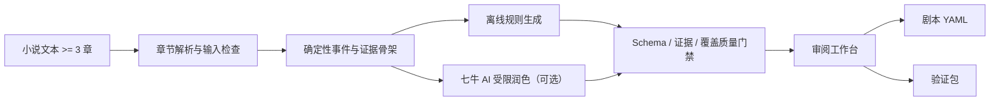

# 溯源剧本工作台

> 让小说改编结果可控制、可验证、可追溯。

面向小说作者的 AI 辅助剧本创作工具。导入不少于 3 个章节的小说后，系统生成符合 YAML Schema 的结构化剧本初稿，并展示每个场次的来源章节、原文证据、事件覆盖关系与质量门禁。

项目提供两种真实运行模式：

- **离线规则模式（不调用 AI）**：无密钥、断网也可稳定演示，生成可追溯剧本骨架。
- **七牛 AI 受限润色模式**：配置合法七牛 API Key 与模型后可用；AI 只能在确定性来源骨架内润色，所有结果仍须通过质量门禁。

仓库地址：<https://github.com/YingJinyan/ai-novel-to-script>

## 核心差异

普通小说转剧本工具重点是“生成”。本项目进一步回答三个问题：

1. **依据是什么**：每个场次关联来源章节、来源事件和真实原文摘录。
2. **有没有遗漏**：事件覆盖矩阵逐项展示事件与场次关系。
3. **结果能否交付**：Schema、证据链、覆盖率与禁止改编规则组成质量门禁。

AI 不直接控制证据链。系统先生成确定性来源骨架，再允许 AI 受限润色；AI 动作文本必须逐字包含来源证据摘录，否则拒绝结果。

## 已完成功能

- 导入或粘贴 3–100 章小说，识别中文、英文和 Markdown 章节标题。
- 展示章节数、总字符数、空章、重复标题和其他输入问题。
- 离线生成结构化剧本，不伪造无法证明的人物和地点。
- 可选七牛 AI 受限润色，未配置时明确显示不可用。
- 场次导航、动作内容、来源证据和改编动作审阅。
- 逐事件覆盖矩阵与质量门禁报告。
- 编辑 YAML 后重新执行 Schema、证据链和覆盖质量门禁。
- 下载符合 Schema 的剧本 YAML。
- 下载包含 `screenplay` 与 `source_texts` 的独立验证包。
- 独立 YAML Schema、设计原因、有效示例和自动校验。
- FastAPI 交互式接口文档、结构化错误和生产 CORS 配置。

## 快速启动

环境要求：

- Windows 10/11
- Python 3.10
- Node.js 22 或兼容版本

首次安装：

```powershell
cd D:\job\ai_novel_to_script
py -3.10 -m pip install -r requirements-dev.txt
cd frontend
npm install
cd ..
```

一键启动本地演示：

```powershell
.\scripts\start-demo.ps1
```

脚本会启动后端与前端并打开 <http://127.0.0.1:5173>。停止演示：

```powershell
.\scripts\stop-demo.ps1
```

也可分别启动：

```powershell
# 终端 1
py -3.10 -m uvicorn backend.main:app --reload

# 终端 2
cd frontend
npm run dev
```

后端接口文档：<http://127.0.0.1:8000/docs>

## 演示路径

1. 打开页面，确认顶部显示“离线规则模式（不调用 AI）”。
2. 使用预置三章示例，点击“解析并检查”。
3. 查看章节统计和输入问题，点击“生成结构化剧本”。
4. 选择场次，展示真实来源证据和改编动作。
5. 展示事件覆盖矩阵与质量门禁。
6. 修改 YAML 制造错误，重新校验并展示门禁阻断；修复后恢复通过。
7. 下载剧本 YAML 和验证包。
8. 可选：配置七牛 Key 后展示受限 AI 润色及作者复核警告。

详细录制脚本见 [Demo 视频脚本](docs/demo-script.md)。

## 七牛 AI 配置

仓库**不会保存真实 API Key**。申请或重置七牛 API Key 后，仅在本机终端设置：

```powershell
$env:QINIU_AI_API_KEY="你的真实 Key"
py -3.10 -m uvicorn backend.main:app --reload
```

页面会通过后端安全读取七牛 `/v1/models` 返回的可用模型，用户可直接选择。系统优先推荐适合结构化文本改编的模型，并标记可能较慢的推理模型与当前任务不推荐的视觉模型。也可选填 `QINIU_AI_MODEL` 作为默认模型。不要把真实值写入 `.env.example`，不要提交 `.env`。完整可信边界见 [七牛 AI 接入文档](docs/ai-provider.md)。

在设置密钥的同一个 PowerShell 窗口中执行一次真实验收：

```powershell
.\scripts\verify-qiniu.ps1 -Model deepseek-v3
```

该脚本会真实调用一次七牛 AI，并检查模型来源、场次数、质量门禁和作者复核警告；只输出非敏感摘要，不输出密钥或 AI 生成正文。若模型不遵守受限输出契约，脚本会如实失败，不会以离线结果冒充 AI 成功。

## 质量检查

运行全部检查：

```powershell
.\scripts\check.ps1
```

等价核心命令：

```powershell
py -3.10 -m pytest -q
py -3.10 -m compileall -q backend scripts tests
py -3.10 scripts/check_no_secrets.py
cd frontend
npm run build
npm test -- --run
npm audit --audit-level=high
```

## 架构



```text
frontend/   React + TypeScript 审阅工作台
backend/    FastAPI、章节流水线、七牛提供商、质量门禁
schema/     可执行剧本 JSON Schema
examples/   三章来源示例与有效 YAML
docs/       竞品、Schema、AI、演示和提交文档
scripts/    校验、一键启动和密钥防误提交脚本
```

## YAML Schema

- [Schema 设计文档与设计原因](docs/yaml-schema.md)
- [可执行 JSON Schema](schema/screenplay.schema.json)
- [有效 YAML 示例](examples/screenplay.example.yaml)

Schema 将项目元数据、改编约束、来源章节、故事设定、叙事事件、场次和证据链分层管理。来源章节使用 SHA-256，事件保留原文摘录及字符位置，场次必须声明来源或明确标记为新增内容。

## 开发过程

项目使用独立分支和单功能 PR，`main` 始终保持可运行：

- [PR #1：竞品调研](https://github.com/YingJinyan/ai-novel-to-script/pull/1)
- [PR #2：可追溯 YAML Schema 与质量门禁](https://github.com/YingJinyan/ai-novel-to-script/pull/2)
- [PR #3：结构化剧本验证 API](https://github.com/YingJinyan/ai-novel-to-script/pull/3)
- [PR #4：可信离线小说转剧本流水线](https://github.com/YingJinyan/ai-novel-to-script/pull/4)
- [PR #5：解析与生成 API](https://github.com/YingJinyan/ai-novel-to-script/pull/5)
- [PR #6：可追溯剧本审阅工作台](https://github.com/YingJinyan/ai-novel-to-script/pull/6)
- [PR #7：质量门禁保护的七牛 AI 接入](https://github.com/YingJinyan/ai-novel-to-script/pull/7)
- [PR #8：可复现演示与提交材料](https://github.com/YingJinyan/ai-novel-to-script/pull/8)
- [PR #9：七牛可用模型发现与选择](https://github.com/YingJinyan/ai-novel-to-script/pull/9)
- [PR #10：剧本 YAML 编辑与重新校验](https://github.com/YingJinyan/ai-novel-to-script/pull/10)
- [PR #11：七牛模型选择引导](https://github.com/YingJinyan/ai-novel-to-script/pull/11)
- [PR #12：不泄露密钥的七牛真实调用验收工具](https://github.com/YingJinyan/ai-novel-to-script/pull/12)

## 原创功能

- 多格式章节解析与输入质量诊断。
- 不伪造不可证明实体的离线剧本生成流水线。
- 剧本 YAML Schema、来源证据链与覆盖质量门禁。
- 确定性骨架约束下的七牛 AI 润色协议。
- 场次、证据、事件覆盖和质量门禁联动审阅工作台。
- 剧本 YAML 与验证包分离导出。

## 第三方依赖

| 依赖 | 用途 |
| --- | --- |
| FastAPI、Uvicorn | 后端 API 与接口文档 |
| Pydantic | 请求响应和 AI 受限输出契约 |
| httpx | 七牛 API 调用与接口测试 |
| PyYAML、js-yaml | YAML 读取、生成与前端预览 |
| jsonschema | 执行剧本 Schema 校验 |
| React、React DOM | 前端工作台 |
| Vite、TypeScript | 前端构建与类型检查 |
| pytest、Vitest、Testing Library | 后端、前端和交互测试 |

## 已知边界

- 仓库不包含真实七牛密钥，因此七牛线上调用需在部署前配置并验证。
- 离线规则模式不会猜测人物身份、具体地点或深层语义。
- AI 文案仍需作者复核；系统能保护结构与证据链，但不能替代作者判断。
- 当前提供本地演示与部署配置，不包含付费托管服务。

## 提交材料

最终提交操作见 [作品提交清单](docs/submission-checklist.md)。

## License

本项目用于七牛云实训营作品开发。未经作者许可，不得复制或用于其他参赛作品。
